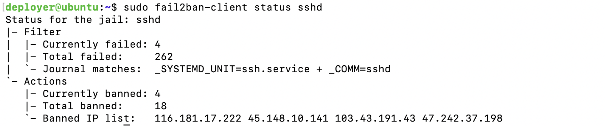
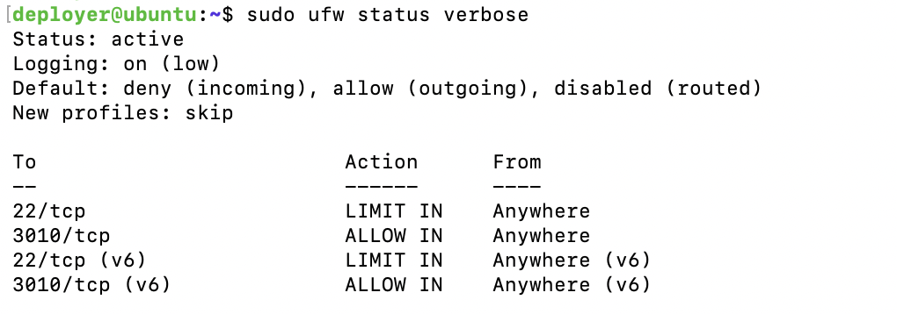

# Security Operations & Audit Guide

This document outlines how to monitor, verify, and audit the defensive security stack running on the Ouroboros Leios VPS host.

## Architecture Overview

The node host relies on a multi-layered defense strategy:
* **OpenSSH Key-Only Auth:** Password authentication (`PasswordAuthentication no`) and direct root login (`PermitRootLogin no`) are strictly disabled.
* **UFW Rate-Limiting:** Restricts connection bursts on port `22/tcp` and opens `3010/tcp` for Leios P2P traffic.
* **Fail2ban (`sshd` jail):** Automatically blocks IPs exhibiting repeated pre-authentication failures.

## Real-Time Log Inspection  & Administrative Commands 

1. **Check live SSH authentication events:** 

To inspect live SSH traffic and observe active connection attempts:

```bash
sudo journalctl -u ssh -n 50 --no-pager
```
2. **Fail2ban Jail Status & IP Management:**

To inspect active jail metrics and see banned IP addresses:

```bash
sudo fail2ban-client status sshd
```
**Example Terminal Output:**

<p align="center">
  
  <br>
  <em>Figure 1: Active Fail2ban sshd jail status and banned IP list</em>
</p>

**Unban an IP Address:** If an authorized IP is accidentally locked out, unban it via:

```bash
sudo fail2ban-client set sshd unbanip <IP_ADDRESS>
```

3. **Check UFW Firewall Rules:** 

Verify active packet rules and port bindings:

```bash
sudo ufw status verbose
```
**Example Terminal Output:**

<p align="center">
  
  <br>
  <em>Figure 2: Active UFW Status</em>
</p>